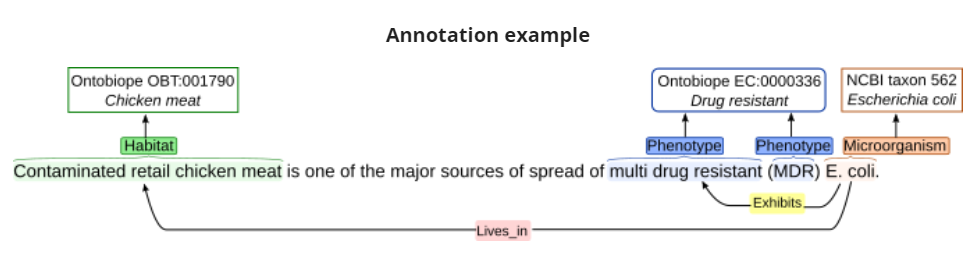
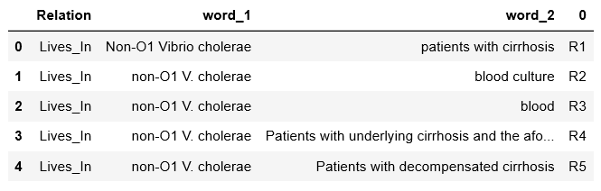

# Bacteria-Biotope-at-BioNLP-OST-2019
The Bacteria Biotope (BB) Task is part of the BioNLP Open Shared Tasks 

## Install required libraries
```
pip install -r requirements.txt
```
## Dataset Description

The representation scheme of the BB task contains four entity types:

1.  Microorganisms
2.  Habitats
3.  Geographical places
4.  Phenotypes

Relation types:

1.  Lives_in relations which link a Microorganism entity to a location (either a Habitat or a Geographical entity)
2.  Exhibits relations which link Microorganism entity to a Phenotype entity.

The sub task here is to find the relationship between the entities 

**Entity and relation extraction subtask (BB-rel)**
BB-rel: Extraction of Lives_In relations between Microorganism, Habitat and Geographical entities, and of Exhibits relations between Microorganism and Phenotype entities.
The Dataset of the BB-rel contans the following
**a1 files:**
```
T1	Title 0 104	[The infections from "Serratia" in the Hospital S. Camillo De Lellis of Roma (Italy) (author's transl)].
T2	Microorganism 22 30	Serratia
T3	Habitat 39 68	Hospital S. Camillo De Lellis
T4	Geographical 72 76	Roma
T5	Geographical 78 83	Italy
```
**a2 files**
```
R1	Lives_In Microorganism:T2 Location:T5
R2	Lives_In Microorganism:T2 Location:T3
R3	Lives_In Microorganism:T2 Location:T4
```

### Objective
Given the a1 file extract it's corresponding a2 file that extracts the relationship between entities.

### Data preprocessing
1.  The data preprocessing includes the creation of a csv tabel for the data as follows

2.  The stopwords were removed
3.  All the words were made in lower cases
4.  The numbers were removed

### Sentence to vectors

The pre-trained Fast-text model of english wiki has been used to convert all the sentences to vectors. 
Then various machine learning algorithms such as Random forest Classifier, SVM, LGBoost and XGBoost has been deployed to extract relationships.

### Results on validation data

| Algorithm  | Accuracy |
| ------------- | ------------- |
| KNN | 0.90625  |
| Random Forest Classfier (criterion='gini')  | 0.922697 |
|  Random Forest Classfier (criterion='entropy') | 0.9391447  |
| LGBClassifier | 0.9111842  |
| SVM |0.95065789  |

### The final results on test data are published on the website under the team name of Amrita_CEN
https://sites.google.com/view/bb-2019/evaluation-results?authuser=0


